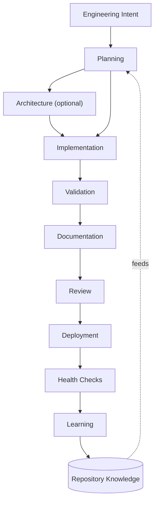

# Engineering Lifecycle

> Status: Concept. SEOS models software engineering as a lifecycle, not as a collection of GitHub Actions. The lifecycle is the abstraction; workflows and labels are implementation details.

## The lifecycle

Source: [`assets/lifecycle.mmd`](../assets/lifecycle.mmd).

## Each stage

| Stage | Question it answers | Owner | Today |
|-------|---------------------|-------|-------|
| **Engineering Intent** | What should change, and why? | Human | GitHub issue |
| **Planning** | What exactly does "done" mean? | Planning Agent → human approves | `issue-spec.yml` |
| **Architecture** *(optional)* | Do the structure, boundaries, or APIs need to change? | Architecture Agent → human approves | Planned |
| **Implementation** | Produce a small, reviewable change. | Coding Agent | `issue-implement.yml` |
| **Validation** | Does it build, pass tests, avoid regressions? | Testing Agent / CI | Partial (Fasted CI) |
| **Documentation** | Are docs and examples still true? | Documentation Agent | Planned |
| **Review** | Is it correct, safe, accessible, high quality? | Review / Security / Accessibility Agents → human approves merge | Partial (Fasted bots) |
| **Deployment** | Ship it and confirm it's healthy. | Deployment Agent | Partial (Fasted deploy) |
| **Health Checks** | Is production actually working? | Deployment Agent | Partial (Fasted health-check) |
| **Learning** | What did this run teach us? | Knowledge Agent | Planned |
| **Repository Knowledge** | Persist lessons for next time. | Knowledge Engine | Planned |

## Why a lifecycle instead of workflows

Three reasons:

1. **Stability.** GitHub Actions, labels, and even the workflow engine may change. The lifecycle stages will not. Documenting the abstraction protects the design from its implementation.
2. **Completeness.** A lifecycle exposes the *gaps*. Listing every stage makes it obvious that Validation, Documentation, and Learning are not yet first-class — which is exactly what the [Roadmap](../00-vision/ROADMAP.md) tracks.
3. **Reusability.** A new repository adopts the *lifecycle*, then fills in the stages it needs. It does not inherit Fasted's specific Actions.

## The feedback loop

The lifecycle is a loop, not a line. Knowledge captured at the end feeds context at the beginning. A pattern learned in one issue makes the Planning and Coding agents better on the next. This loop is what turns SEOS from automation into an *operating system that improves itself*.

## Related reading

- [State Machine](STATE_MACHINE.md) — how these stages map to GitHub labels
- [Human Gates](HUMAN_GATES.md) — where humans must approve
- [Agent Roles](../03-agents/README.md) — who performs each stage
