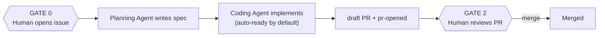

# Human Gates

> Status: Concept. Human gates are the non-negotiable core of SEOS. This document defines what humans own, what agents own, and where the gates sit.

## The principle

Agents perform bounded engineering work. Humans remain accountable. SEOS is designed so that the decisions with real-world consequences — direction, prioritization, secrets, production, merge — always pass through a human.

Never remove an intentional human approval gate. This is a design invariant, not a default to be tuned away.

## Ownership

### Humans always own

- **Product direction** — what the software should become.
- **Business decisions** — trade-offs with real-world stakes.
- **Prioritization** — what gets worked on and when.
- **Repository ownership** — the codebase and its history.
- **Secrets** — API keys, credentials, tokens.
- **Production** — what actually ships and runs.
- **Final merge approval** — nothing lands without a human.

### Agents own

- **Planning** — turning intent into a concrete spec.
- **Implementation** — producing a small, reviewable PR.
- **Analysis** — reviewing code, security, accessibility, architecture.
- **Documentation** — keeping docs and examples current.
- **Recommendations** — proposing, never deciding.
- **Automation** — mechanical, deterministic steps.

## The gates today

SEOS keeps **two permanent human gates**. Auto-spec and auto-ready are defaults that speed the middle of the pipeline; they do not remove accountability.

- **Gate 0 — Intent.** Opening the issue (or applying `needs-spec` when auto-spec is off) is product prioritization. Opt out with `no-agent` or `[no-agent]` in the title/body.
- **Gate 1 — Spec approval (optional).** By default, `ready` is applied automatically after the spec. Restore a human pause with `agent-manual` or `AGENT_AUTO_READY_ENABLED=false`. Use this when the requirement is ambiguous or high-risk.
- **Gate 2 — Merge approval (always).** The Coding Agent opens a **draft** PR. It never merges. A human reviews the diff, the screenshots, and the tests, then merges. This is where a human owns what enters `main`.

Tier 2 (review bots, deploy) adds *checks* but never removes Gate 0 or Gate 2 — it makes the merge decision better-informed, not automatic.

## Why gates are permanent

- **Accountability requires a decider.** If no human approved a change, no human is responsible for it.
- **Reversibility has limits.** A bad merge or a bad deploy can be expensive. Small PRs reduce blast radius; human gates prevent the blast.
- **Trust is earned by transparency, not by autonomy.** The value of SEOS is a legible, human-controlled system — not the removal of humans from the loop.

## Related reading

- [State Machine](STATE_MACHINE.md) — where gates appear as states
- [Engineering Philosophy](../00-vision/ENGINEERING_PHILOSOPHY.md)
- [Agent Roles](../03-agents/README.md) — each role documents its own human-approval points
