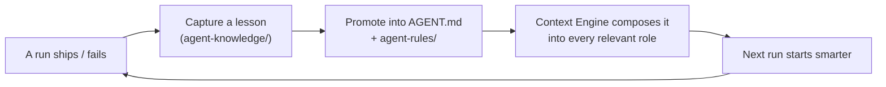

# Knowledge System

> Status: **Built** (skeleton). SEOS scaffolds `.github/agent-knowledge/` on install. The promote-into-`AGENT.md` discipline is documented here and proven in [Fasted](../06-case-studies/FASTED.md). It closes the loop of the [Engineering Lifecycle](ENGINEERING_LIFECYCLE.md): what an agent learns should improve the next agent.

## The principle

Knowledge should compound. Every run teaches something — a pattern that worked, a failure to avoid, a gap in the context. Without a place to put that learning, it evaporates when the Action completes. The Knowledge System turns lessons into a durable asset that feeds future context.

## The model (as proven in Fasted)

A `.github/agent-knowledge/` directory holds:

- **`README.md`** — what the knowledge base is, and *when* to add an entry: post-deploy health failure, a recurring CI failure pattern, an architecture decision that should guide future specs, or an agent mistake a rule update would prevent.
- **`TEMPLATE.md`** — a fixed lesson shape so entries are comparable and actionable:
  - *What happened* (the failure/regression/surprise)
  - *Root cause* (why)
  - *Fix applied* (code, CI, or process)
  - *Rule updates needed* (a checklist: update `AGENT.md`? a rule module? a workflow/test?)
  - *Prevention* (one sentence the next agent should remember)
- **Dated entries** — `YYYY-MM-DD-issue-NN.md`, appended newest-first during review, optionally via a small `append-agent-lesson` script.

The crucial step is the last line of the template: **Rule updates needed.** A lesson is not "done" when it's written down — it's done when it has been promoted into `AGENT.md` or a rule module, where the [Context Engine](../02-architecture/CONTEXT_ENGINE.md) will compose it into every relevant agent's context. That is what makes knowledge *compound* rather than accumulate.

## Why this belongs in the framework

- **It's the loop that makes SEOS an operating system, not a script.** Automation that never learns is just automation. A system that improves its own context is an operating layer.
- **It's generic.** The *mechanism* — a lesson template, a place to store lessons, and a discipline of promoting them into the guide — is product-agnostic. Only the *lessons themselves* are repository-specific.
- **It has a natural owner.** The [Knowledge Agent](../03-agents/README.md) captures lessons after shipping (Fasted's guiding principle #6: "Learn after shipping").

## What migrates into SEOS vs stays in the repo

| Concern | Where it belongs |
|---------|------------------|
| `agent-knowledge/` convention + `README.md` + `TEMPLATE.md` | **SEOS framework** (scaffolded) |
| `append-agent-lesson` helper + review cadence guidance | **SEOS framework** |
| The actual lessons and the promoted rules | **Consuming repository** |

## Human gates

Promoting a lesson into a rule changes how every future agent behaves — so it stays a **human-reviewed** step, not an automatic rewrite of the repository's guide. See [Human Gates](HUMAN_GATES.md).

## Related reading

- [Context Engine](../02-architecture/CONTEXT_ENGINE.md) — where promoted lessons take effect
- [Engineering Lifecycle](ENGINEERING_LIFECYCLE.md) — Learning → Knowledge is the closing loop
- [Fasted case study](../06-case-studies/FASTED.md)
