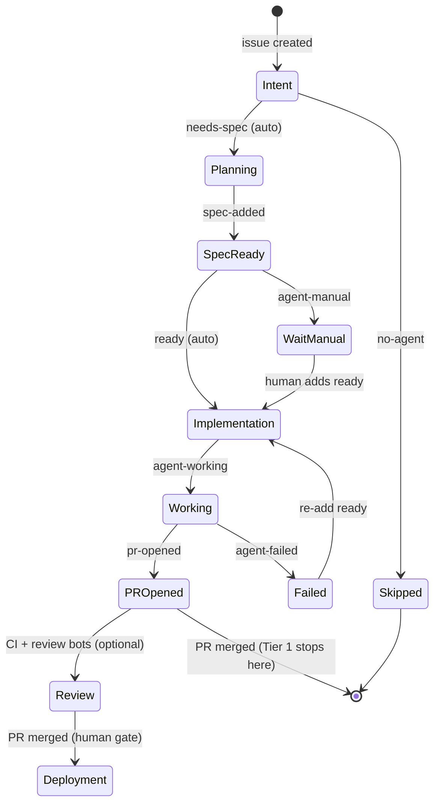

# State Machine

> Status: Concept. The [lifecycle](ENGINEERING_LIFECYCLE.md) is the abstraction. GitHub labels are one concrete implementation of it. This document maps the two together.

## The principle

Think in **engineering states**, not GitHub labels. Labels are how SEOS *renders* state onto GitHub today — a visible, auditable state machine on every issue. If the workflow engine changes, the states stay; only the rendering changes.

## Conceptual states

```
Intent → Planning → Architecture → Implementation → Validation
→ Documentation → Review → Deployment → Learning
```

## Label implementation (today)



Source: [`assets/state-machine.mmd`](../assets/state-machine.mmd).

## State → label mapping

| Conceptual state | GitHub label | Applied by | Gate |
|------------------|--------------|------------|------|
| Intent | *(issue open)* | Human | **Human opens issue** |
| Planning requested | `needs-spec` | Auto on open (or human) | — |
| Planning complete | `spec-added` | Planning Agent | optional pause via `agent-manual` |
| Implementation approved | `ready` | Auto after spec (or human) | — |
| Implementation running | `agent-working` | Implement dispatch | — |
| Implementation complete | `pr-opened` | Coding Agent | **Human reviews PR** |
| Implementation failed | `agent-failed` | Workflow on failure | re-add `ready` to retry |
| Opt out | `no-agent` / `agent-manual` | Human | — |
| Review / Deployment / Learning | *(Tier 2, see recipes)* | Optional agents | **Human merges** |

Full label reference: [docs/LABELS.md](../../docs/LABELS.md).

## Reliability: chain jobs, don't rely on bot labels

GitHub's `GITHUB_TOKEN` does **not** fire other `on: labeled` workflows when a bot applies a label. SEOS therefore chains planning → implement **inside the same workflow** (`issue-auto-triage.yml`, and `issue-spec.yml` when auto-ready applies). Manual `ready` still uses `issue-implement.yml` (human actor).

## Design rules for states

- **Every transition is observable.** A label change, a comment, or a PR marks each move. Nothing happens silently.
- **Failure is a first-class state.** `agent-failed` is reversible — re-adding `ready` retries. Errors never leave an issue stuck.
- **Gates are explicit.** Opening the issue and merging the PR are always human. Auto-ready is a default, not a removed gate.
- **The map is not the territory.** Adding a label does not define behavior; the *state* does. New implementations (e.g. a different tracker) map the same states onto their own primitives.

## Related reading

- [Engineering Lifecycle](ENGINEERING_LIFECYCLE.md)
- [Human Gates](HUMAN_GATES.md)
- [Labels](../LABELS.md)
