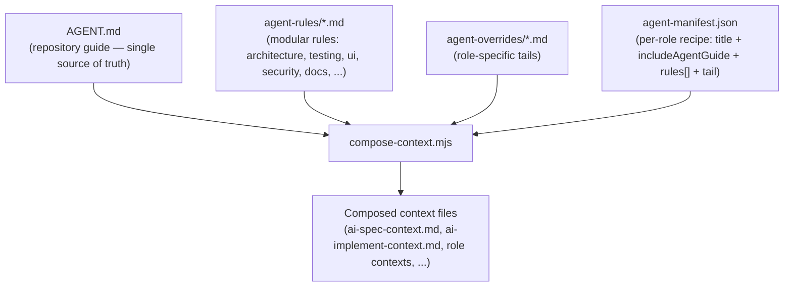

# Context Engine

> Status: **Built.** The Context Engine ships with SEOS (`packages/dispatch/compose-context.mjs`, scaffolded by `npx @mitchdawkinsjr/seos init`). Proven first in [Fasted](../06-case-studies/FASTED.md).

## The problem it solves

Repository context is preferred over generic prompting — but naive context files rot:

- The same instruction (stack, conventions, human gates) gets copy-pasted into `ai-spec-context.md`, `ai-implement-context.md`, review contexts, and every new role. Change one, forget the others → **drift**.
- Each new agent role needs its own context file, multiplying the duplication.
- There is no single source of truth for "what this repo is."

The Context Engine replaces hand-maintained per-role prompts with **composition from small, single-source modules**.

## The model (as proven in Fasted)

### The four inputs

1. **`AGENT.md`** — the canonical repository guide. Project purpose, architecture summary, the label state machine, the agent roster, testing commands, guiding principles. Every role that sets `includeAgentGuide: true` gets it. This is the "employee handbook."
2. **`agent-rules/*.md`** — small, composable rule modules, one per discipline (`architecture-rules`, `testing-rules`, `ui-rules`, `security-rules`, `documentation-rules`, `product-rules`, `commit-rules`, `accessibility-rules`). Each rule is written **once** and reused across every role that needs it.
3. **`agent-overrides/*.md`** — role-specific "tails" appended after the shared material (e.g. the exact output format a spec agent must produce).
4. **`agent-manifest.json`** — the recipe book. For each output file it declares: a `title`, whether to `includeAgentGuide`, the ordered list of `rules`, and the `tail`.

### The composer

`compose-context.mjs` reads the manifest and, for each output, concatenates: a generated "do not edit" header → title → (optional) the repository guide with its top heading stripped → each named rule → the tail. Two modes:

- **default** — regenerate all composed context files.
- **`--check`** — fail if any composed file differs from what the sources would produce. This is the **drift gate**: run it in CI so context files can never silently fall out of sync with `AGENT.md` and the rules.

## Why this is the right architecture

- **Single source of truth.** A convention lives in exactly one rule module. Every role that needs it composes it in.
- **No duplicated prompts.** Directly satisfies the [Design Principle](../00-vision/DESIGN_PRINCIPLES.md) against duplicated prompts.
- **Composable roles.** Adding a role is a manifest entry (a recipe), not a new hand-written prompt.
- **Deterministic + observable.** Composition is pure; the `--check` mode makes drift a build failure, not a surprise.
- **Framework/repository separation is clean.** The **mechanism** (composer + manifest schema + directory convention) is generic and belongs in SEOS. The **content** (a specific repo's rules and guide) stays in the consuming repository. SEOS ships the engine and empty/example modules; the repo fills them in.

## What migrates into SEOS vs stays in the repo

| Concern | Where it belongs |
|---------|------------------|
| `compose-context.mjs` composer | **SEOS framework** (generic) |
| `agent-manifest.json` schema + default recipes | **SEOS framework** (with sensible defaults) |
| `agent:compose` / `agent:compose --check` scripts + CI gate | **SEOS framework** |
| Directory convention (`AGENT.md`, `agent-rules/`, `agent-overrides/`) | **SEOS framework** (scaffolded by the CLI) |
| The *content* of `AGENT.md` and each rule module | **Consuming repository** (product-specific) |

## Where it lives

| Path | Role |
|------|------|
| `packages/dispatch/compose-context.mjs` | Composer (synced to consumer `scripts/`) |
| `context/agent-guide.base.md` | Template for `AGENT.md` |
| `context/rules/`, `context/overrides/` | Default rule modules and role tails |
| `context/agent-manifest.json` | Default recipes (spec + implement) |
| `npm run agent:compose` / `agent:compose:check` | Regenerate / drift gate |

## Related reading

- [Architecture Overview](OVERVIEW.md)
- [Knowledge System](../01-concepts/KNOWLEDGE_SYSTEM.md) — knowledge feeds back into `AGENT.md`, which feeds the Context Engine
- [Fasted case study](../06-case-studies/FASTED.md)
