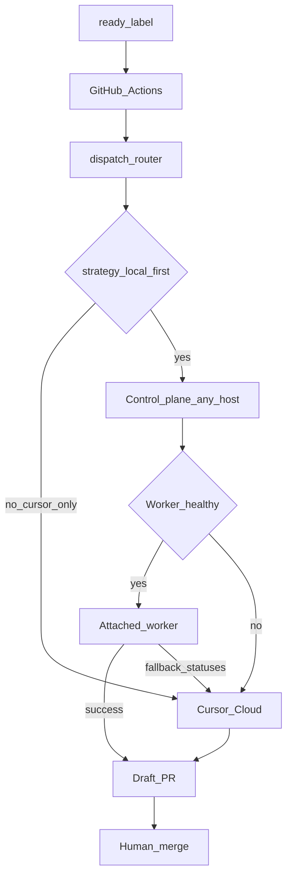

# Local-First Runtime

> Status: **Partial (Phase 1)**. Default implement strategy is **cursor-only** (no control plane, no local worker). Opt into **local-first** to route through a control plane on *any* host you choose and a worker on *any* machine you attach; Cursor Cloud remains the fallback with branch-preserving handoff. GitHub Actions remains the event source.

## Responsibility matrix

| Component | Primary responsibility |
|-----------|------------------------|
| GitHub Actions | Issue/label events, concurrency, calling the router |
| Control plane *(optional)* | Queue, worker health, dispatch, retries, Cursor fallback — run on a VPS, cloud VM, lab box, or skip entirely via `cursor-only` |
| Worker *(optional)* | Local planning/coding/testing, draft PR preparation — any system you tie into SEOS (Mac, Linux, workstation, …) |
| Cursor Cloud | Default path, or fallback when workers are offline / timed out / failed validation |
| Human | Review and merge approval |

## Flow



**Bypass:** with `agents.implementation.strategy: cursor-only` (the default), the router never calls the control plane — worker and control-plane hosts are unused.
## Configuration

Default remains **cursor-only**. Opt in via `.github/seos.yml`:

```yaml
agents:
  implementation:
    strategy: local-first
    primary:
      worker: mac-m1-max
      provider: ollama
      model: qwen2.5-coder:7b
    fallback:
      provider: cursor-cloud
      model: composer-2.5
    policy:
      max_local_attempts: 2
      timeout_minutes: 35
      require_changes: true
      require_validation: true
controlPlane:
  url: https://seos.example.com
```

Secrets / env for Actions and the control plane:

- `CONTROL_PLANE_URL` (or `controlPlane.url`)
- `CONTROL_PLANE_TOKEN`
- `CURSOR_API_KEY` (fallback provider)
- `GH_TOKEN` / GitHub token with issue + PR permissions

## Control plane (any host)

Optional. Run on a VPS, cloud VM, on-prem box — wherever you want the queue. Typical install path: `/opt/apps/seos` (Docker Compose). Endpoints:

| Method | Path | Purpose |
|--------|------|---------|
| `GET` | `/healthz` | Liveness |
| `POST` | `/v1/jobs` | Enqueue implement job (from GHA) |
| `GET` | `/v1/jobs/:id` | Job status |
| `POST` | `/v1/workers/heartbeat` | Worker registration + health |
| `GET` | `/v1/workers` | List workers |
| `POST` | `/v1/workers/:id/claim` | Claim next queued job |
| `POST` | `/v1/jobs/:id/result` | Structured agent result |

Auth: `Authorization: Bearer <CONTROL_PLANE_TOKEN>`.

Skip this entirely when `strategy: cursor-only`.

## Worker registration

Any machine you attach registers with declared capabilities (example id is illustrative — use your own):

```yaml
worker:
  id: mac-m1-max   # or linux-lab-1, workstation-a, …
  capabilities:
    - local-llm
    - planning
    - coding
    - testing
    - review
    - documentation
    - docker
    - 64gb-unified-memory
```

Phase 1 concurrency: **one** heavy local job at a time per worker process (`packages/mac-worker` is the reference client; the host need not be a Mac).

## Structured agent results

```json
{
  "status": "validation_failed",
  "agent": "implementation",
  "worker": "mac-m1-max",
  "model": "qwen2.5-coder:7b",
  "attempts": 2,
  "changedFiles": 4,
  "branch": "seos/issue-142",
  "failedCommands": ["npm test"],
  "summary": "Implementation completed, but two integration tests remain failing.",
  "fallbackRecommended": true,
  "diff": "...",
  "changedFileList": ["src/a.ts", "src/b.ts"]
}
```

Recommended statuses:

`success` · `failed` · `blocked` · `timeout` · `worker_offline` · `model_unavailable` · `no_changes` · `invalid_patch` · `validation_failed`

## Cursor Cloud fallback

Escalate when:

- Worker offline / heartbeat stale
- Local model unavailable
- Local timeout
- No valid changes
- Invalid patch
- Validation failed after allowed repair attempts
- Max local attempts reached
- Task labeled for cloud / security-critical / architecture-heavy (Phase 2+ policy)

On escalation, Cursor continues from local work:

- Original issue + specification
- Current branch (`startingRef` = local branch, not default branch)
- Diff, changed files, failed commands, local summary

## Packages

| Package | Role |
|---------|------|
| [`packages/control-plane`](../../packages/control-plane/) | Control-plane dispatcher (any host) |
| [`packages/mac-worker`](../../packages/mac-worker/) | Reference worker client (heartbeat → claim → harness → result) |
| [`packages/dispatch`](../../packages/dispatch/) | Router, Cursor provider, handoff builder |

## Deploy

```bash
# Host "vps" in ~/.ssh/config, or:
SEOS_SSH_HOST=<your-vps-host> \
SEOS_SSH_IDENTITY=~/.ssh/<key-authorized-on-vps> \
./scripts/deploy-control-plane.sh
```

Prod install path: `/opt/apps/seos` (Docker Compose). Point `CONTROL_PLANE_URL` at your control plane (HTTP on `:8787`, or HTTPS behind your reverse proxy / DNS).

See [`packages/control-plane/README.md`](../../packages/control-plane/README.md).

## Related reading

- [Architecture Overview](OVERVIEW.md)
- [Coding Agent](../03-agents/CODING_AGENT.md)
- [Human Gates](../01-concepts/HUMAN_GATES.md)
- [Roadmap](../00-vision/ROADMAP.md)
