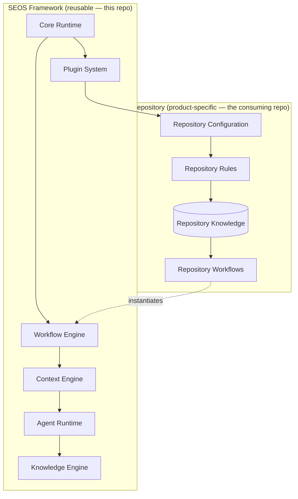

# Architecture Overview

> Status: Architecture. This document describes the layered design SEOS evolves toward, and maps each layer to what exists in the repository today. Deeper per-layer documents (Core Runtime, Workflow Engine, Context Engine, Agent Runtime, Plugin System, Configuration) will follow as those layers are formalized — see the [Roadmap](../00-vision/ROADMAP.md).

## The layered model

Source: [`assets/architecture.mmd`](../assets/architecture.mmd).

The dividing line is the most important part of the diagram: **framework concerns are reusable and product-agnostic; repository concerns are product-specific.** Project-specific behavior stays outside the runtime whenever possible.

## The layers

### Core Runtime
The entry point and orchestration glue. Responsible for reading configuration, selecting the workflow engine, and wiring the other layers together. *Today:* implicit — the workflows and dispatch script are the de facto runtime. *Direction:* extract an explicit, testable core.

### Workflow Engine
Triggers and sequences engineering work in response to events. *Today:* GitHub Actions — `workflows/issue-spec.yml` and `workflows/issue-implement.yml`, driven by label events. *Direction:* keep GitHub Actions as the default engine; keep the engine swappable behind the lifecycle abstraction.

### Context Engine
Assembles the repository-specific context an agent needs, from base templates + stack presets + repository knowledge. *Today:* static context files (`context/ai-*.base.md`, `context/presets/*`) rendered at install time by the CLI, plus `.github/ai-*-context.md` read at run time. *Direction:* a `compose-context` capability that assembles context dynamically and eliminates duplicated prompts.

### Agent Runtime
Dispatches bounded [agent roles](../03-agents/README.md) and manages their lifecycle. *Today:* `packages/dispatch` routes implementation — default **cursor-only** via Cursor Cloud (control plane and worker bypassed); optional **local-first** via a control plane on *any* host + a worker on *any* machine you attach, with Cursor fallback ([Local-First Runtime](LOCAL_FIRST_RUNTIME.md)). The spec workflow calls OpenAI directly. *Direction:* a uniform role runtime where every discipline is dispatched the same way.

### Knowledge Engine
Captures lessons, patterns, and failures, and feeds them back into context. *Today:* not implemented — knowledge lives informally in the hand-edited context files. *Direction:* durable [repository knowledge](../01-concepts/WHAT_IS_SEOS.md) that compounds over time.

### Plugin System
Lets SEOS support new stacks and frameworks through configuration rather than runtime edits. *Today:* the seed exists as stack presets (`context/presets/vite-react.md`, `nextjs.md`, `generic.md`) selected by the CLI. *Direction:* generalize presets into installable engineering plugins.

### Repository layer
What the consuming repo provides: configuration (`.github/seos.yml`), rules, knowledge, and its own workflow instances. This is where — and the only place where — product-specific behavior belongs.

## How a request flows

1. A human files an issue and labels it (`needs-spec`). — *Repository event*
2. The **Workflow Engine** fires on the label. — *`issue-spec.yml`*
3. The **Context Engine** supplies repo context. — *`ai-spec-context.md`*
4. The **Agent Runtime** runs the Planning Agent. — *OpenAI call*
5. A human approves (`ready`); the engine fires again. — *Gate + `issue-implement.yml`*
6. The Agent Runtime dispatches the Coding Agent with composed context. — *`packages/dispatch` router* (Cursor Cloud by default, or local-first → your control plane → your worker / Cursor fallback)
7. A draft PR appears; a human merges. — *Gate*
8. *(Direction)* The **Knowledge Engine** records what was learned. — *Planned*

## Design constraints

- **Framework never depends on the repository.** SEOS must never import or assume Fasted.
- **Layers depend downward, not sideways.** Higher layers orchestrate lower ones; lower layers don't know their callers.
- **Swappable implementations.** GitHub Actions, OpenAI, and Cursor are *current implementations* of the Workflow Engine and Agent Runtime, not permanent assumptions.
- **Configuration over modification.** Adding a stack or framework should be config, not a code change.

## Related reading

- [What Is SEOS?](../01-concepts/WHAT_IS_SEOS.md)
- [Design Principles](../00-vision/DESIGN_PRINCIPLES.md)
- [Local-First Runtime](LOCAL_FIRST_RUNTIME.md)
- [Agent Roles](../03-agents/README.md)
- [Roadmap](../00-vision/ROADMAP.md)
