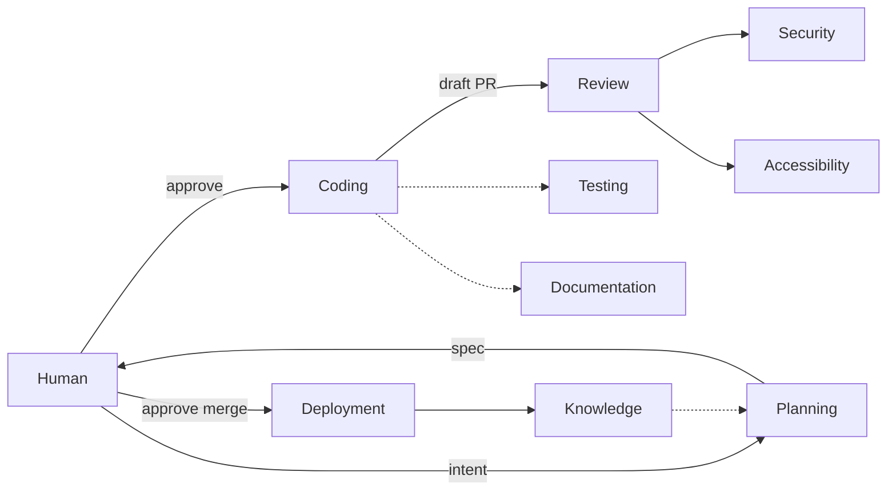

# Agent Roles

> Status: Concept + reference. Each engineering discipline in SEOS is an independent, bounded agent role. This directory documents the contract every role follows and the status of each role.

## The role model

An agent role is a **bounded specialist**, not a general assistant. It performs one engineering discipline, produces defined outputs, and escalates to a human when it hits the edge of its authority. Roles are small on purpose: a monolithic "do everything" agent is reviewable by no one.

Every role documents the same eight-part contract (see [`_ROLE_TEMPLATE.md`](_ROLE_TEMPLATE.md)):

1. **Mission** — the one job this role exists to do.
2. **Responsibilities** — what it does.
3. **Inputs** — what it reads.
4. **Outputs** — what it produces.
5. **Success Criteria** — how we know it did well.
6. **Escalation Conditions** — when it must stop and defer to a human.
7. **Human Approval Points** — the gates it cannot cross alone.
8. **Expected Deliverables** — the concrete artifacts of a run.

## The roles

| Role | Discipline | Status | Doc |
|------|-----------|--------|-----|
| Planning Agent | Turn intent into a spec | **Built** | [PLANNING_AGENT.md](PLANNING_AGENT.md) |
| Architecture Agent | Evaluate structure, boundaries, migrations | Partial (Fasted) | *(roadmap)* |
| Coding Agent | Implement a small, reviewable PR | **Built** | [CODING_AGENT.md](CODING_AGENT.md) |
| Testing Agent | Recommend tests, improve coverage, catch regressions | Partial (Fasted) | *(roadmap)* |
| Documentation Agent | Keep docs and examples current | Partial (Fasted) | *(roadmap)* |
| Review Agent | Review code quality, recommend improvements | Partial (Fasted) | *(roadmap)* |
| Security Agent | Review auth, secrets, dependencies, vulnerabilities | Partial (Fasted, specialist) | *(roadmap)* |
| Accessibility Agent | Review and prevent accessibility regressions | Partial (Fasted, specialist) | *(roadmap)* |
| Deployment Agent | Coordinate releases, run health checks | Partial (Fasted) | *(roadmap)* |
| Knowledge Agent | Capture lessons and patterns into repository knowledge | Partial (Fasted) | *(roadmap)* |

Status meanings match the [Roadmap](../00-vision/ROADMAP.md): **Built** (runs in production framework), **Partial** (proven in the [Fasted](../06-case-studies/FASTED.md) consumer, not yet promoted into the framework), **Planned** (designed, not implemented). As of the latest Fasted flow, every discipline in this table is at least **Partial** — the framework's job now is to generalize the mechanism, not invent the roles.

Fasted runs some roles as **specialists** (UI, Accessibility, Security) triggered manually via a *PR Specialist Review* workflow rather than on every PR — a deliberate cost/signal trade-off worth preserving when these roles are generalized.

## Rules for roles

- **One discipline per role.** If a role needs a second mission statement, it should be two roles.
- **Add roles only for real disciplines.** Do not create agents for trivial tasks. A new role must represent a meaningful engineering discipline.
- **Every role escalates.** A role that can never fail or defer is hiding risk. Escalation conditions are mandatory.
- **Human gates are declared, not implied.** Each role lists exactly which decisions it cannot make alone. See [Human Gates](../01-concepts/HUMAN_GATES.md).

## Adding a role

A future guide (`04-guides/ADD_NEW_AGENT.md`) will cover the mechanics. Until then: copy [`_ROLE_TEMPLATE.md`](_ROLE_TEMPLATE.md), fill in all eight sections, add the role to the table above and to [`assets/agent-system.mmd`](../assets/agent-system.mmd), and confirm it earns its place against the [Design Principles](../00-vision/DESIGN_PRINCIPLES.md).
