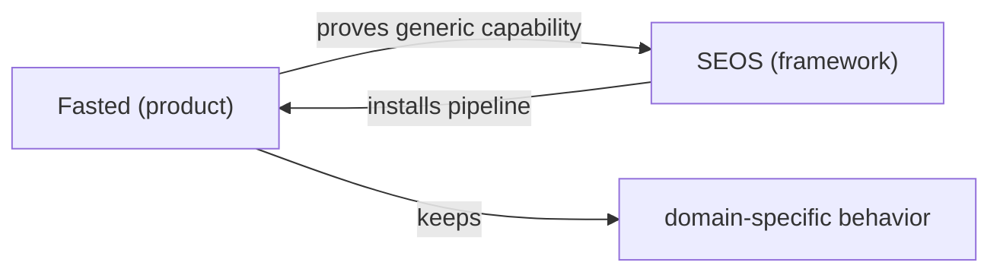

# Case Study: Fasted

> Status: Case study. [Fasted](https://github.com/mitchelldawkinsjr/Fasted) is the first production implementation of SEOS. It is the proving ground — not a dependency. This document records what Fasted demonstrates and how its lessons flow back into the framework.

## The relationship

- **Fasted is the consumer.** It installs the SEOS pipeline and runs it against a real product.
- **SEOS is the framework.** It must never import or assume Fasted.
- **The flow of value is one-directional at the framework boundary:** generic capabilities proven in Fasted migrate *into* SEOS; domain-specific behavior stays *inside* Fasted.

## What Fasted proves (Tier 1) — now in SEOS

The core pipeline — [Planning Agent](../03-agents/PLANNING_AGENT.md) → [Coding Agent](../03-agents/CODING_AGENT.md) → human merge — ran in production on Fasted and now ships with `npx seos init`:

- Open issue → auto `needs-spec` → repo-aligned spec comment.
- Auto `ready` (unless `agent-manual`) → Cursor cloud agent opens a small draft PR with `Fixes #N`.
- A human reviews and merges.
- Context Engine + workflow chaining + opt-out labels are framework capabilities.

Reference issues: [Fasted #30](https://github.com/mitchelldawkinsjr/Fasted/issues/30) (pipeline docs) and the production narrative in the [blog post](https://www.mitchelldawkins.com/blog/team-of-engineers-cursor-agent-pipeline).

## What Fasted proves (Tier 2)

Fasted also runs the optional hardening layer that SEOS documents as recipes and tracks on the [Roadmap](../00-vision/ROADMAP.md) as **Partial**:

| Fasted workflow | Lifecycle stage | Recipe |
|-----------------|-----------------|--------|
| `ci.yml` (build + Playwright e2e, docker build) | Validation | [ci-gates](../../docs/recipes/ci-gates.md) |
| `pr-review.yml` (Bugbot + Ponytail) | Review | [pr-review-bots](../../docs/recipes/pr-review-bots.md) |
| `security.yml` (`npm audit` + secret scan) | Security | ci-gates |
| `a11y-audit.yml` (axe + Playwright) | Accessibility | ci-gates |
| `deploy-vps.yml` (gated deploy) | Deployment | ci-gates |
| `health-check.yml` (scheduled VPS/HTTP) | Health Checks | ci-gates |
| `ponytail-audit.yml` (monthly over-engineering scan) | Learning | ci-gates |

Reference: [Fasted #47](https://github.com/mitchelldawkinsjr/Fasted/issues/47).

## What Fasted proves now (the evolved flow)

Since the SEOS foundation docs were written, Fasted has grown well past the two-stage pipeline. These are the capabilities the framework should now generalize (tracked as **Partial** on the [Roadmap](../00-vision/ROADMAP.md)):

### A manifest-driven Context Engine — **migrated**
Fasted no longer hand-maintains each context file. SEOS now ships `compose-context.mjs` + `agent-manifest.json` + `AGENT.md` / `agent-rules/` / `agent-overrides/` with an `agent:compose --check` drift gate. Fasted still has a richer role roster (architecture, specialists); the **mechanism** is framework-owned. See [Context Engine](../02-architecture/CONTEXT_ENGINE.md).

### A Knowledge Engine — **skeleton migrated**
SEOS scaffolds `.github/agent-knowledge/` (README + TEMPLATE). Fasted's promote-into-`AGENT.md` discipline is the model. See [Knowledge System](../01-concepts/KNOWLEDGE_SYSTEM.md).

### A fuller agent roster
Beyond Planning and Coding, Fasted now runs **Architecture** (`issue-architecture.yml`, `needs-architecture` gate), **Testing** (`pr-test-agent.yml`), **Documentation** (`issue-docs.yml`), **Deployment** (`deploy-context.md`), and **specialist** UI / Accessibility / Security agents triggered manually via a *PR Specialist Review* workflow. Every discipline in the [agent roster](../03-agents/README.md) is now at least **Partial**.

### Default-hands-off automation with opt-out gates — **Tier 1 migrated**
SEOS default flow: open issue → **auto** `needs-spec` → spec → **auto** `ready` → implement → **you merge**. Opt out with `no-agent`, `agent-manual`, or `[no-agent]`; disable stages via `AGENT_AUTO_SPEC_ENABLED` / `AGENT_AUTO_READY_ENABLED`. Fasted still has architecture routing, review labels, and one-pass auto-fix (Partial on the [Roadmap](../00-vision/ROADMAP.md)). The two core [human gates](../01-concepts/HUMAN_GATES.md) — open the issue, merge the PR — are untouched.

## Lessons that shaped the framework

- **Small, reversible PRs are the load-bearing habit.** Fasted runs stayed reviewable because each issue produced one focused diff. This is now [Design Principle #1](../00-vision/DESIGN_PRINCIPLES.md).
- **Behavior gaps are context gaps.** When the Coding Agent misbehaved, the fix was almost always a rule/context change, not a code change. Fasted's answer — the [Context Engine](../02-architecture/CONTEXT_ENGINE.md) and [Knowledge System](../01-concepts/KNOWLEDGE_SYSTEM.md) — is now built there and is the model SEOS adopts.
- **Bot-added labels don't trigger downstream workflows, so chain jobs instead.** GitHub's `GITHUB_TOKEN` won't fire further `on: labeled` workflows, which caused *both* false failures and duplicate dispatches. Fasted fixed it by **chaining spec → architecture → implement as jobs inside one workflow** and adding a `concurrency` group (`cursor-implement-${issue}`, `cancel-in-progress: false`). Any generalized SEOS automation must inherit this pattern.
- **Extract shell logic into reusable scripts.** Fasted moved workflow bodies into `scripts/generate-issue-spec.sh`, `generate-architecture-review.sh`, and `run-issue-implement.sh` so multiple workflows share one implementation — the same reasoning behind SEOS keeping dispatch in `packages/dispatch`.
- **Not every agent belongs in the automatic loop.** UI/Accessibility/Security run as manual specialists in Fasted for cost, redundancy, and signal reasons. Generalize the *capability* but preserve the *opt-in* default.
- **Review bots need explicit boundaries.** Fasted tells the implement agent *not* to run `gh pr ready` so the review workflow owns that transition — captured in the [pr-review-bots recipe](../../docs/recipes/pr-review-bots.md). This is why roles declare their [human-approval points](../01-concepts/HUMAN_GATES.md) explicitly.

## The migration test

Before copying anything from Fasted into SEOS, ask: *is this generic?*

- **Generic** (belongs in the framework): the pipeline shape, label state machine, dispatch mechanics, the `compose-context` engine + manifest schema, the `agent-knowledge` structure, the automation/opt-out model, the workflow-chaining + concurrency patterns, and the CI/review/deploy *patterns*.
- **Domain-specific** (stays in Fasted): VPS hostnames, product routes, business rules, the *content* of `AGENT.md` and the rule modules, specific test suites, credentials.

Never copy hostnames, credentials, or product logic into the framework or into public docs.

## Related reading

- [Roadmap](../00-vision/ROADMAP.md) — how Partial capabilities become framework features
- [Design Principles](../00-vision/DESIGN_PRINCIPLES.md) — the separation rule
- [Architecture Overview](../02-architecture/OVERVIEW.md)
