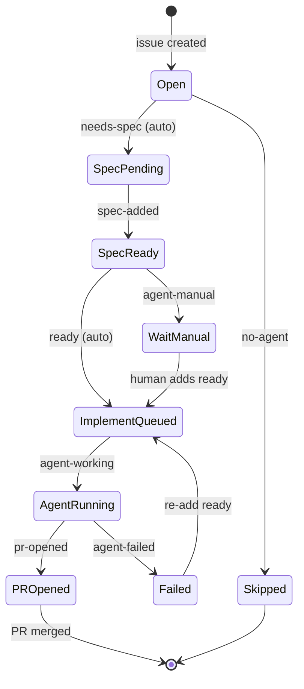

# GitHub labels

SEOS uses labels as a visible state machine on each issue. Labels are **one implementation** of the SEOS [state machine](01-concepts/STATE_MACHINE.md) — they render conceptual [engineering-lifecycle](01-concepts/ENGINEERING_LIFECYCLE.md) states onto GitHub.

## Labels mapped to lifecycle stages

| Label | Lifecycle stage | Agent role |
|-------|-----------------|------------|
| `needs-spec` → `spec-added` | [Planning](01-concepts/ENGINEERING_LIFECYCLE.md) | [Planning Agent](03-agents/PLANNING_AGENT.md) |
| `ready` → `agent-working` → `pr-opened` | [Implementation](01-concepts/ENGINEERING_LIFECYCLE.md) | [Coding Agent](03-agents/CODING_AGENT.md) |
| `agent-failed` | failure state (re-add `ready` to retry) | — |
| `no-agent` / `agent-manual` | opt-out gates | — |

## Label reference

| Label | Applied by | Meaning |
|-------|------------|---------|
| `needs-spec` | Auto on open (or human) | Request AI acceptance criteria |
| `spec-added` | Planning agent | Spec comment posted on the issue |
| `ready` | Auto after spec (or human) | Trigger implementation |
| `agent-working` | Implement dispatch | Cursor cloud agent is running |
| `pr-opened` | Coding agent (or manual fallback) | Implementation PR is open |
| `agent-failed` | Implement on failure | Dispatch or implementation failed; safe to retry |
| `no-agent` | Human | Skip the automated pipeline |
| `agent-manual` | Human | Auto-spec only; require manual `ready` |

## State machine

```text
Open → needs-spec → spec-added → ready → agent-working → pr-opened → (merged)
  │                      ↑                      ↑              ↓
  │                      └──── agent-manual ────┘        agent-failed
  └── no-agent / [no-agent] (stop)
```



## Reliability note

Bot-added labels **do not** trigger other `on: labeled` workflows (`GITHUB_TOKEN` restriction). SEOS therefore **chains** planning and implement jobs inside the same workflow (`issue-auto-triage.yml`, and `issue-spec.yml` when auto-ready applies). Manual `ready` (human or `agent-manual`) still uses `issue-implement.yml`.

## Creating labels

Labels are created automatically on first workflow run. To create them upfront:

```bash
npx seos init --create-labels --repo owner/repo --yes
```

Or manually under **Issues → Labels** using the colors in the table above.
